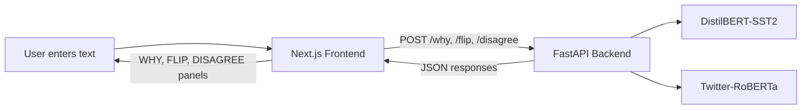

# AXOVRA Mission 3: AI/Data Recruiter and Research Proof Pack

**Student:** Parshvi Jain  
**Track:** Flagship AI/Data Proof Conversion  
**Flagship Proof:** XAI Forensics  
**Target Role:** Applied AI / ML Engineer, especially at early-stage startups  

**Live Tool:** [xai-forensic.vercel.app](https://xai-forensic.vercel.app)  
**Source Code:** [github.com/parshvi1508/XAI_Forensic](https://github.com/parshvi1508/XAI_Forensic)  
**Backend API Docs:** [jainparshvi-xai-forensics-backend.hf.space/docs](https://jainparshvi-xai-forensics-backend.hf.space/docs)  
**Published X Post:** [x.com/Jain_1508/status/2054495308479095201](https://x.com/Jain_1508/status/2054495308479095201?s=20)  

## What Changed Since Mission 2

Mission 2 converted XAI Forensics from a deployed technical project into a clear case study with a named user, real use case, technical workflow, evidence, limitations, and role relevance.

Mission 3 converts that case study into assets I can actually use while applying. The same proof is now packaged for a recruiter, a research mentor, a GitHub visitor, an interviewer, and an application reviewer. The goal is not to repeat the case study in five formats. The goal is to present the same work differently depending on what each audience needs to understand first.

This proof pack includes a concise portfolio entry, an upgraded GitHub README, three resume bullets, two professional proof post drafts, a 60-second interview explanation, a three-minute technical walkthrough, a five-line application message, and a final Proof Vault entry.

## A. Proof Title

**XAI Forensics: Model Decision Inspection for Sentiment Classifiers**

## B. Short Summary

XAI Forensics is a deployed model-inspection tool that helps ML engineers stress-test sentiment model decisions before trusting them in production. It combines LIME token attribution, counterfactual word removal, and dual-model disagreement analysis to reveal why a prediction happened, whether it is fragile, and whether it changes across training domains.

This Mission 3 pack turns the project into recruiter-ready, research-mentor-ready, GitHub-ready, interview-ready, and application-ready proof.

## C. Main Output Link

**Live deployed tool:**  
https://xai-forensic.vercel.app

## D. Application Evidence Pack

1. **Live frontend:**  
   https://xai-forensic.vercel.app

2. **GitHub repository and technical README:**  
   https://github.com/parshvi1508/XAI_Forensic

3. **Backend API documentation:**  
   https://jainparshvi-xai-forensics-backend.hf.space/docs

4. **Recorded demo video:**  
   https://drive.google.com/file/d/1lEXwtQ5qg7sJCF9Ytm_dGJDJ0hVGeCAS/view?usp=sharing

5. **Screenshots folder:**  
   https://drive.google.com/drive/folders/11JUx4fUnQ1k7CbEm3P8uiRbt7b71yEUX?usp=sharing

6. **Published build post on X:**  
   https://x.com/Jain_1508/status/2054495308479095201?s=20

The evidence pack includes the live landing page, WHY token attribution, FLIP counterfactual output, DISAGREE model comparison, API documentation, source code, and a recorded walkthrough.

# Output 1: AI/Data Recruiter and Research Proof Pack

## E. Proof Vault and Portfolio Case Study

### Project Overview

Sentiment models can perform well on benchmark datasets and still fail on real language. Negation, sarcasm, backhanded compliments, and domain-shifted text can produce confident but unreliable predictions. A model confidence score does not explain why a prediction happened, whether the decision depends on one word, or whether another model trained on a different domain would reach the same conclusion.

XAI Forensics was built to inspect these questions before a model decision is trusted.

### Named User

The primary user is an ML engineer or data scientist preparing to deploy a sentiment classifier in a product such as:

- Support ticket triage
- Review moderation
- Social listening
- Customer feedback analysis

### Decision Supported

For an ambiguous input, the engineer needs to decide whether the prediction is stable enough to trust, whether the text should be routed to human review, or whether the failure indicates a domain gap that should be addressed through retraining or better evaluation data.

### How the Tool Works

The user enters a short English sentence. The Next.js frontend sends three requests to a FastAPI backend. The backend runs three independent inspection methods and returns structured JSON results.

#### WHY: Token Attribution

WHY uses LIME to generate perturbed versions of the input, rerun the classifier, and estimate which tokens influenced the local prediction.

It answers:

> Which words pushed the model toward this verdict, and by how much?

The implementation uses roughly 300 perturbations per explanation. LIME was selected because it is model-agnostic and practical for a black-box inspection tool. SHAP was considered but rejected because of its higher transformer inference cost on free-tier CPU. Attention weights were not used as the main explanation because attention is not automatically a reliable explanation of model decisions.

#### FLIP: Counterfactual Fragility

FLIP removes each word one at a time, reruns the model, and finds the deletion that causes the largest change in positive-class confidence.

It answers:

> Can removing one word significantly change the prediction?

The output includes the removed word, original and modified labels, confidence change, and whether the final verdict flipped. The method is simple, deterministic, and easy to explain, but word deletion can create unnatural text.

#### DISAGREE: Dual-Model Comparison

DISAGREE sends the same text through DistilBERT-SST2 and Twitter-RoBERTa. The models were trained on different language domains, so their disagreement can reveal domain sensitivity.

It answers:

> Does a model trained on informal social text interpret this input differently from a model trained on formal movie reviews?

The tool reports both predictions, both positive-class scores, the absolute confidence gap, and whether the labels agree.

### System Architecture

| Layer | Technology | Deployment |
|---|---|---|
| Frontend | Next.js, React, Tailwind CSS | Vercel |
| Backend | Python, FastAPI, PyTorch | Hugging Face Spaces |
| Models | Hugging Face Transformers | Loaded at backend startup |
| Explainability | LIME | Backend |
| Storage | None | Stateless per request |

The tool does not use a database, authentication system, paid API, cache, or queue. It is a public MVP designed for transparent model inspection.

### Frontend Reliability Decision

The frontend uses `Promise.allSettled` rather than `Promise.all`. This allows successful panels to render even when one endpoint fails. Each panel handles its own error, and the application shows a fatal network error only when all three requests fail.

This decision matters because WHY is computationally heavier than the other methods. A slow or failed explanation should not prevent the faster FLIP and DISAGREE outputs from being shown.

### Output

For each input, the tool returns:

- Predicted sentiment and confidence
- Token-level attribution weights
- Highest-impact removed word
- Original and modified predictions
- Confidence delta
- Verdict flip status
- Two-model confidence comparison
- Agreement or disagreement status
- Combined stability interpretation

### Technical Result

The project produces a working inspection workflow rather than a static notebook. A reviewer can enter their own input, observe all three methods, inspect the source code, and verify the public API.

The current README also includes a reproducible latency benchmark. On warm free-tier CPU runs, DISAGREE remains the fastest because it requires only two forward passes. FLIP scales with sentence length because it reruns inference after candidate word removals. WHY is the slowest because LIME requires many perturbed inference calls.

### What This Proves

- I can identify a real model-evaluation gap rather than treating inference as the final result.
- I can implement explainability and counterfactual analysis around transformer models.
- I can compare models trained on different domains and interpret disagreement.
- I can make engineering tradeoffs under latency, cost, and infrastructure constraints.
- I can build and deploy a decoupled frontend and backend.
- I can document limitations instead of overstating what an explanation method proves.
- I can package technical work for recruiters, research mentors, and interviewers.

### Limitations

- LIME produces approximate local explanations, not causal proof.
- Greedy token deletion can produce ungrammatical counterfactual text.
- Two-model comparison is not a full ensemble evaluation.
- The tool is sentiment-specific and currently tested only on English.
- Input length is capped at 1000 characters.
- The free-tier backend can have a cold start after inactivity.
- The tool currently demonstrates failures case by case rather than measuring them across a labeled adversarial benchmark.

### Next Improvement

The next improvement is quantitative self-evaluation. I would create a small labeled benchmark containing negation, sarcasm, backhanded compliments, and domain-shifted language. I would then report flip rate, disagreement rate, and failure patterns by category.

That would move the project from showing individual model failures to measuring how often each inspection signal appears across a controlled test set.

## F. GitHub README Upgrade

The GitHub README has been upgraded from a basic project description into technical documentation that a recruiter, engineer, or research mentor can inspect without opening the full codebase.

**Updated README:**  
https://github.com/parshvi1508/XAI_Forensic

The README now includes:

- Clear project overview
- Explanation of why sentiment is the test task rather than the final goal
- Live frontend, backend, and API documentation links
- WHY, FLIP, and DISAGREE methodology
- Model selection and training-domain differences
- Architecture and API endpoints
- Local setup instructions
- Latency notes and reproducible benchmark
- Security and cost decisions
- Known behavior and limitations
- Technology stack
- Screenshots and example input

The strongest README improvement is that it explains both what the code does and why each technical decision was made.

## G. Three Resume Bullets

### Technical Bullet

Built and deployed XAI Forensics, a transformer decision-inspection tool combining LIME token attribution, greedy counterfactual testing, and dual-model disagreement analysis through a FastAPI backend and Next.js frontend.

### Impact and Use-Case Bullet

Developed a pre-deployment sentiment audit workflow that helps ML engineers identify fragile predictions, negation errors, sarcasm confusion, and training-domain mismatch before model outputs reach production workflows.

### Research and Problem-Solving Bullet

Compared local attribution, counterfactual sensitivity, and cross-domain model behavior; selected LIME over SHAP under CPU and latency constraints, rejected attention as the primary explanation, and documented the limits of approximate XAI methods.

## H. Professional Proof Posts

I do not consider this project strong enough for a major LinkedIn announcement in its current form, so I used X as the public build log. The published post is included as evidence. The two drafts below remain available for a future professional platform or portfolio update.

### Post 1: Project and Case Study Draft

Sentiment models can look reliable on a benchmark and still fail on the exact language people use in production.

I built XAI Forensics to inspect a model decision before trusting it.

The tool asks three questions:

1. WHY: Which words influenced this verdict?
2. FLIP: Can removing one word change the prediction?
3. DISAGREE: Does a model trained on another language domain reach the same conclusion?

The backend combines LIME attribution, greedy counterfactual testing, and comparison between DistilBERT-SST2 and Twitter-RoBERTa. The frontend presents all three signals independently and continues rendering partial results even if one analysis fails.

The project is deployed, open source, and documented with public API endpoints, latency benchmarks, tradeoffs, and known limitations.

Live tool: https://xai-forensic.vercel.app  
Source: https://github.com/parshvi1508/XAI_Forensic

The main lesson was that model confidence is not the same as model reliability. Before trusting a prediction, it helps to inspect what drove it, how fragile it is, and whether it survives a change in training domain.

## I. 60-Second Interview Explanation

Sentiment models often fail on negation, sarcasm, and informal language even when they perform well on benchmark data. The problem is that a confidence score does not tell an engineer why a prediction happened or whether it is stable.

I built XAI Forensics, a deployed tool that stress-tests an individual sentiment prediction in three ways. WHY uses LIME to show which words influenced the verdict. FLIP removes words one at a time to test whether the label depends heavily on a single token. DISAGREE compares DistilBERT-SST2 with Twitter-RoBERTa to reveal sensitivity to different training domains.

The backend is built with FastAPI and Hugging Face Transformers, while the frontend uses Next.js. I also used partial failure handling so one slow endpoint does not block the other results.

The main limitation is that the tool currently demonstrates failures case by case. My next step would be evaluating it on a labeled adversarial benchmark and reporting results by failure category.

## J. Three-Minute Technical Walkthrough

XAI Forensics started from a simple production concern: a sentiment classifier can return a confident label without giving an engineer enough information to decide whether that label should be trusted.

The tool accepts a short English input and sends three requests from a Next.js frontend to a FastAPI backend. The backend has two Hugging Face sentiment models loaded at startup. Model A is DistilBERT-SST2, trained on formal movie-review language. Model B is Twitter-RoBERTa, trained on a large informal tweet corpus.

The first endpoint is WHY. It uses LIME for local token attribution. LIME creates perturbed versions of the input by masking words, reruns Model A across those variations, and fits a local linear approximation around the original prediction. The output is a list of token weights showing which words pushed the prediction toward the positive or negative class. I used around 300 perturbations because the tool runs on free-tier CPU and needs to remain usable as an interactive demo.

The second endpoint is FLIP. It removes each word one at a time, reruns Model A, and measures the change in positive-class confidence. The system returns the word whose removal caused the largest absolute confidence shift. It also reports whether the final label changed. This is a deterministic and interpretable fragility test, although deletion can make the modified sentence ungrammatical.

The third endpoint is DISAGREE. It runs the same input through both models and calculates the absolute difference between their positive-class confidence scores. I used a plain confidence gap rather than a more formal measure because the output should remain understandable to a non-specialist. If the labels differ, or the confidence gap is large, the input may be sensitive to training domain.

The frontend calls all three endpoints using `Promise.allSettled`. This was important because WHY is much slower than DISAGREE. If one request fails or times out, the other panels can still render. Each panel also has independent error handling.

The project has no database, authentication, or paid API. Requests are stateless, no user text is stored, and the backend runs on Hugging Face Spaces while the frontend runs on Vercel.

The main technical tradeoff was choosing methods that were meaningful but still practical on free infrastructure. LIME is slower than a simple attention visualization, but attention was not used as the primary explanation because it is not automatically a reliable explanation. SHAP was considered but was too expensive for this deployment constraint.

The largest current limitation is evaluation. The tool can expose interesting individual failures, but it does not yet report performance across a labeled adversarial set. The next research step would be to measure flip and disagreement rates across negation, sarcasm, and domain-shift categories.

## K. Five-Line Application Message

I am applying for an Applied AI or ML Engineering opportunity.  
My flagship project, XAI Forensics, is a deployed tool for inspecting transformer sentiment decisions before they are trusted in production.  
It combines LIME attribution, counterfactual fragility testing, and cross-domain model disagreement analysis.  
The live tool, source code, API documentation, demo video, screenshots, and technical tradeoffs are publicly available.  
I would value the opportunity to discuss how this model-evaluation and deployment experience could contribute to your team.

# Output 2: Application Evidence Pack

## Evidence Summary

| Evidence | What It Verifies |
|---|---|
| Live frontend | The tool is deployed and interactive |
| GitHub repository | The source code and technical structure exist |
| API documentation | The backend endpoints are public and testable |
| Demo video | The complete workflow runs end to end |
| Screenshots | WHY, FLIP, and DISAGREE produce visible outputs |
| X post | The project was documented publicly during the build |
| README | Architecture, setup, benchmarks, decisions, and limitations are documented |

# Output 3: Proof Vault and Interview Packaging Pack

## L. Skills Proven

- Applied machine learning
- Explainable AI
- Transformer model evaluation
- Counterfactual testing
- Cross-domain model comparison
- FastAPI and Next.js deployment
- Technical documentation and communication

## M. Role Relevance

This project is directly relevant to Applied AI and ML Engineering roles because it shows that I can work beyond basic model inference. I can inspect model behavior, implement evaluation methods, reason about failure modes, and explain technical limitations.

It is especially relevant to early-stage startups because the entire tool was built and deployed under practical constraints. The project combines model evaluation, backend APIs, frontend reliability, public deployment, and documentation without relying on paid infrastructure.

For research internships, the project also shows that I can turn a broad explainability question into testable methods, compare design options, document tradeoffs, and identify the next quantitative evaluation step.

## N. Reflection

### What changed in how I present my AI work?

Earlier, I presented technical projects mainly through features, tools, and deployment links. This mission forced me to present the decision problem first. I now explain who needs the tool, what they are trying to decide, how each method contributes, and where the evidence can be verified.

### Which part of the flagship proof is strongest?

The strongest part is the combination of three inspection methods that answer different questions. WHY explains local influence, FLIP tests fragility, and DISAGREE checks sensitivity to training domain. The combination makes the tool more meaningful than a sentiment prediction interface with one explanation chart.

### What would I say if a recruiter asked me to explain the project?

I would begin with the problem: confidence does not tell us whether a model decision is trustworthy. I would then show the live double-negation example and explain how attribution, counterfactual testing, and model disagreement reveal different kinds of risk.

### What limitation would I honestly mention?

The tool has no aggregate self-evaluation across a labeled adversarial benchmark. It demonstrates model failures on individual examples, but it does not yet measure how often each inspection signal appears across a controlled dataset.

### How will I use this proof in applications?

I will use the technical resume bullet for ML engineering roles, the research bullet for research internships, and the impact bullet for startup applications. I will link the live tool and repository in applications, use the 60-second explanation in initial interviews, and use the three-minute walkthrough for technical discussions.

## O. Final Proof Vault Entry

**Proof Name:**  
XAI Forensics Recruiter and Research Proof Pack

**Proof Type:**  
Applied AI / Explainable AI / Portfolio Case Study / Application Proof Pack

**Target Role:**  
Applied AI / ML Engineer, especially at early-stage startups

**Short Summary:**  
Packaged XAI Forensics into a recruiter-ready and research-mentor-ready proof pack containing a deployed case study, upgraded GitHub documentation, technical evidence, three resume bullets, professional proof post drafts, interview explanations, and an application message.

**What This Proves:**  
Applied AI execution, transformer model inspection, explainability implementation, counterfactual reasoning, cross-domain evaluation, deployment, GitHub documentation, recruiter-readable storytelling, research communication, and interview readiness.

**Skills Demonstrated:**

- Applied machine learning
- Explainable AI
- Transformer model evaluation
- Counterfactual testing
- Cross-domain model comparison
- Full-stack AI deployment
- Technical communication

**Evidence Links:**

- Live Tool: https://xai-forensic.vercel.app
- GitHub: https://github.com/parshvi1508/XAI_Forensic
- API Docs: https://jainparshvi-xai-forensics-backend.hf.space/docs
- Demo Video: https://drive.google.com/file/d/1lEXwtQ5qg7sJCF9Ytm_dGJDJ0hVGeCAS/view?usp=sharing
- Screenshots: https://drive.google.com/drive/folders/11JUx4fUnQ1k7CbEm3P8uiRbt7b71yEUX?usp=sharing
- Published X Post: https://x.com/Jain_1508/status/2054495308479095201?s=20

**Application Assets Included:**

- Three role-specific resume bullets
- Two professional proof post drafts
- One 60-second interview explanation
- One three-minute technical walkthrough
- One five-line application message
- One recruiter-readable portfolio case study
- One upgraded technical README

## AXOVRA Standard Statement

I created an AI/Data recruiter and research proof pack for an AI/Data recruiter, hiring manager, or research mentor evaluating whether a student can build, document, explain, and apply with strong technical proof. It proves my ability in AI/Data proof packaging, technical documentation, use-case communication, recruiter-ready storytelling, resume positioning, research explanation, and interview preparation. I can now use it in my Proof Vault, resume, GitHub, applications, portfolio, and interviews.
